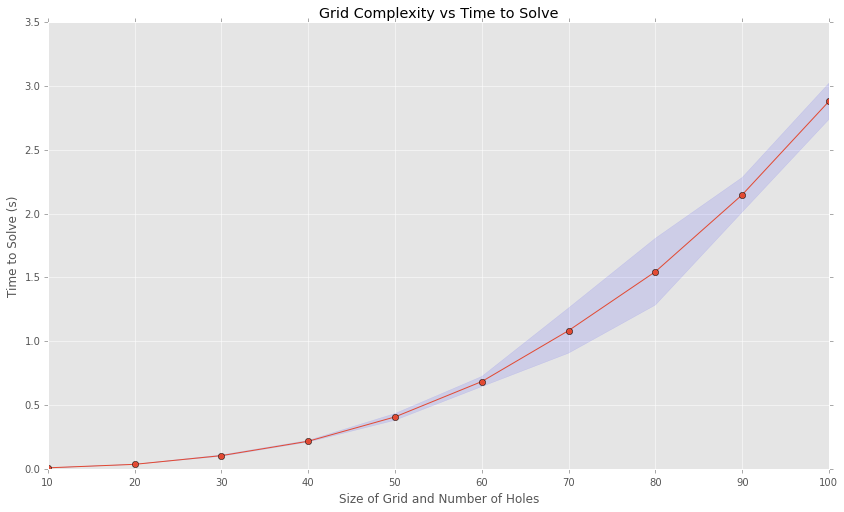
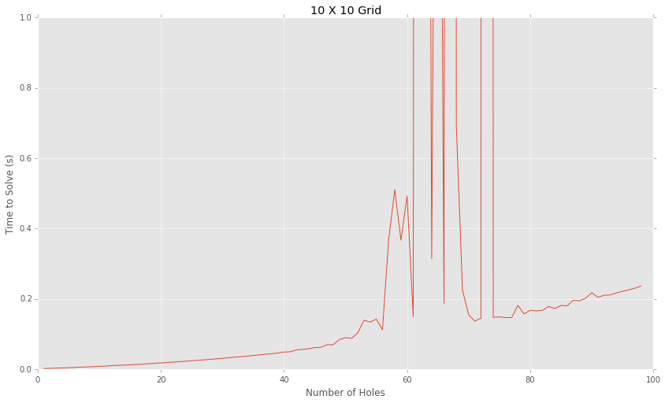

.. _more-info-label:

More Information
================

Implementation Details
----------------------
In order to test our implementation we randomly generate Latin Squares to use.
We do this by creating a naive Latin Square where we start off with all the
elements in order, and then shift each row below over by one, like so:

$$\\begin{array}{ccccc}
1 & 2 & 3 & 4 & 5\\\\
2 & 3 & 4 & 5 & 1\\\\
3 & 4 & 5 & 1 & 2\\\\
4 & 5 & 1 & 2 & 3\\\\
5 & 1 & 2 & 3 & 4
\\end{array}$$

Once we have this naive square we randomize the columns, and then
randomize the rows. Once we have our random square we randomly remove \\(K\\)
holes from it. This will result in a solvable Latin Square, though the solution
is not guaranteed to be unique. For the purposes of this problem the
non-uniqueness does not affect anything.

To help speed up the solve time we used both forward checking and arc
consistency. For arc consistency we keep a list of possible values for each
hole. When the grid is initialized we go through each hole and update the
possible values it can take. After this point any time we assign a value to a
hole we go through any hole in the same column or row and update their
remaining possibilities.

We use forward checking to pick the best hole to evaluate by picking the
hole that has the least number of possible options. Normally you would want to
pick the best possible value from the list of possible values for each hole,
but we have no more information to go on so we simply pick the lowest possible
option and check it. Once we've selected a value we check and make sure that
the grid is still solvable by making sure that all remaining holes have at
least one possible option, and no row or column has double elements. If we
find that we selected a value that results in an invalid grid we will stop
the search and backtrack until we have a valid grid again.

One last python specific optimization is that we use a generator to list
all the children of a search node. Previously we were creating all the nodes,
which involve an expensive copy operation, even if we never looked at the
other nodes. By using a generator the nodes are only created when they are
actually looked at, which requires significantly less computation.

How Well It Works
-----------------
To test how well our implementation works we ran two tests. For the first we
solved grids with \\(N=K\\), which can be seen in figure 1. For
each value of \\(N\\) we generated 10 random grids and plotted the mean time
to solve, and the standard deviation among the solve times. For the second
test we plotted the average solve time for a 10x10 grid with an increasing
number of holes. For each data point we ran the solver on 50 random grids and
plotted the mean solve time. The second test can be seen in figure 2.

    Figure 1: Time to solve for different sizes.

    Figure 2: Solve time for increasing number of holes.

From the results above we can see that the solver does produce results in
reasonable time. For a \\(100\\times 100\\) grid with 100 holes it took on average 3 seconds
to find the solution. It also shows a clear experiential trend that we would
expect to see with a problem like this. Looking at figure 2 we
see that the solver runs into significant trouble once the grid is 50-75\%
empty, which is the expected result of a Latin Square solver so this is not
a cause for concern.
